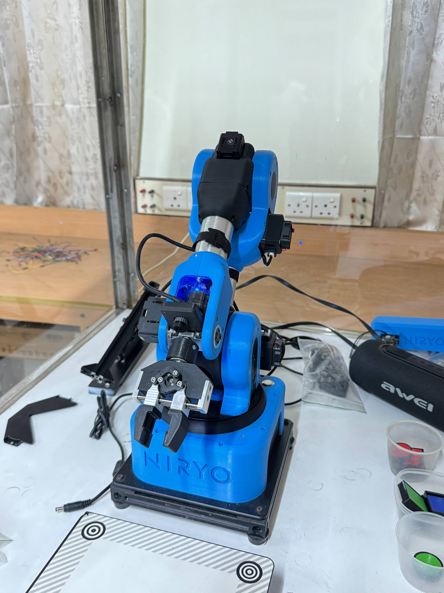
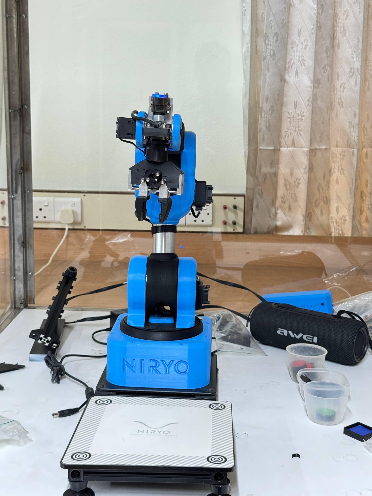
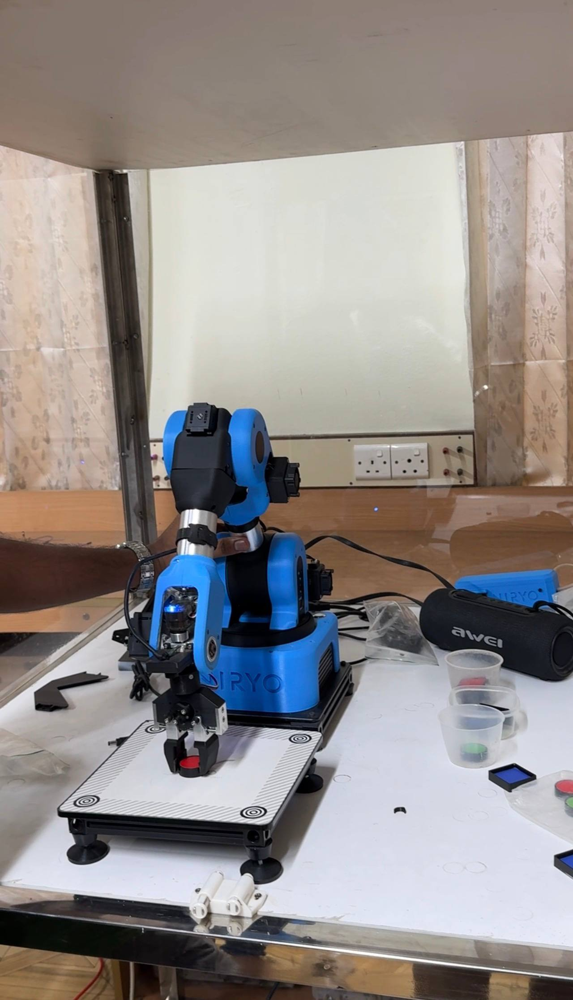

# Niryo Ned — Multi-Modal Robot Control

[](https://www.python.org/)
[](https://opencv.org/)
[](https://mediapipe.dev/)
[](https://www.raspberrypi.com/)

**CSE 3106 — Embedded Systems and Internet of Things Laboratory**
*Department of Computer Science and Engineering*
**Khulna University of Engineering & Technology (KUET)**

A complete multi-modal robot control system integrating **autonomous vision-based pick and place**, **real-time hand gesture control**, and **voice command recognition with Bangla language support** on the Niryo Ned 6-DOF collaborative robotic arm.

---

## Project Gallery

| Home Position | Observation Pose | Picking | Drop and Sort |
|:---:|:---:|:---:|:---:|
|  |  |  |  |

---

## Table of Contents

- [Overview](#overview)
- [Key Features](#key-features)
- [System Architecture](#system-architecture)
- [Hardware Requirements](#hardware-requirements)
- [Software and Dependencies](#software-and-dependencies)
- [Repository Structure](#repository-structure)
- [Module 1 Vision Pick Loop](#module-1-vision-pick-loop)
- [Module 2 Hand Gesture Control](#module-2-hand-gesture-control)
- [Module 3 Voice Command Control](#module-3-voice-command-control)
- [Connection and Setup Guide](#connection-and-setup-guide)
- [Running the Project](#running-the-project)
- [LED Status Indicators](#led-status-indicators)
- [Troubleshooting](#troubleshooting)
- [Team](#team)

---

## Overview

This project implements a **multi-modal control system** for the **Niryo Ned** (6-axis collaborative robotic arm), integrating three fully independent control interfaces that each command the same robot and calibrated vision workspace:

| # | Control Mode | Platform | Description |
|---|---|---|---|
| 1 | **Autonomous Vision Loop** | Niryo Onboard Raspberry Pi | Button-triggered, headless pick and color-sort |
| 2 | **Hand Gesture Control** | Windows Laptop + Phone Camera | MediaPipe hand landmark recognition via Wi-Fi stream |
| 3 | **Voice Command Control** | Raspberry Pi 5 (headless) | Offline/online STT with Bangla Zipformer model |

All three modules communicate wirelessly with the robot at `10.10.10.10`.

---

## Key Features

- Fully autonomous pick and place — color-sorted into RED / GREEN / BLUE bins without human intervention
- Wireless robot control — no physical tethering required for any module
- Dual-engine voice control — Google STT (cloud) and faster-whisper (offline)
- **Bangla language support** via Sherpa-ONNX Zipformer online transducer model
- Spoken audio feedback (TTS) confirming every robot action
- Real-time hand gesture recognition — 4 gestures mapped to robot actions
- Phone-as-camera streaming via Android IP Webcam app over Wi-Fi
- **Physical button trigger** — press the backside button on the Niryo Ned to start VisionPickLoop
- Robust state machine — prevents gesture/voice misfires while robot is mid-motion
- Headless systemd deployment — voice control Pi auto-starts at boot
- HTTP/JSON API integration demonstrated with an external prototype hand robot

---

## System Architecture

```
+----------------------------------------------------------------------+
|                       NIRYO NED ROBOTIC ARM                          |
|              +----------------------------+                          |
|              |  Onboard Raspberry Pi      |                          |
|              |  (ROS + Python 2.7)        |                          |
|              |  [BACKSIDE BUTTON] --------+-> visionPickLoop.py      |
|              |  Onboard Camera            |   (Autonomous Sort)      |
|              +----------------------------+                          |
|                        |  Wi-Fi Hotspot (10.10.10.10)               |
|         +--------------+-----------------+                           |
|         |              |                 |                           |
|         v              v                 v                           |
| +----------------+ +---------------+ +------------------+           |
| | Windows Laptop | | Raspberry Pi 5| | External Robot   |           |
| | gesture_control| | (Headless)    | | (HTTP/JSON API)  |           |
| | _final.py      | |               | |                  |           |
| |                | | voiceCommand  | | joint angles     |           |
| | OpenCV +       | | Final.py      | | via HTTP POST    |           |
| | MediaPipe      | |               | |                  |           |
| | Hand Landmark  | | Whisper/Google| |                  |           |
| |                | | + Zipformer   | |                  |           |
| | Phone Stream   | | Bangla Model  | |                  |           |
| | (IP Webcam)    | | USB Mic+Spkr  | |                  |           |
| +----------------+ +---------------+ +------------------+           |
+----------------------------------------------------------------------+
```

---

## Hardware Requirements

| Component | Model / Type | Role |
|---|---|---|
| **Robotic Arm** | Niryo Ned (6-DOF) | Main manipulator |
| **Onboard Camera** | Niryo USB Camera (wrist-mounted) | Object detection and workspace vision |
| **Gripper** | Niryo 2-Finger Gripper | Object grasping and release |
| **Voice Control Board** | Raspberry Pi 5 | Runs headless voice command service |
| **Microphone** | USB Microphone | Captures user voice commands |
| **Speaker** | USB / Bluetooth Speaker (Awei) | TTS spoken feedback output |
| **Gesture Camera** | Android Phone running IP Webcam | Streams live video for gesture recognition |
| **Processing Host** | Windows Laptop | Runs MediaPipe gesture recognition |
| **Network** | Wi-Fi 2.4 GHz (LAN or Hotspot) | Connects all devices wirelessly |
| **Workspace Mat** | Niryo calibrated board (4 corner markers) | Pixel-to-world coordinate mapping |
| **Colored Objects** | Red / Green / Blue cubes or discs | Test objects for sorting demo |

---

## Software and Dependencies

### Core Python Libraries

```bash
pip install pyniryo2          # Niryo robot control API
pip install opencv-python     # Computer vision and camera handling
pip install mediapipe         # Hand landmark detection
pip install numpy             # Numerical computation
pip install sounddevice       # Audio recording (mic input)
pip install scipy             # WAV file I/O
pip install SpeechRecognition # Google STT wrapper
pip install faster-whisper    # Local offline Whisper STT
pip install pyttsx3           # Text-to-speech (Linux/Windows)
```

### For Raspberry Pi (Voice Control)

```bash
sudo apt install portaudio19-dev python3-pip
pip install pyniryo2 sounddevice scipy SpeechRecognition faster-whisper pyttsx3
```

### Bangla Voice Recognition — Sherpa-ONNX Zipformer

For **Bangla language** voice control, install Sherpa-ONNX:

```bash
pip install sherpa-onnx
```

Download the Bangla Zipformer pretrained model from:

**https://k2-fsa.github.io/sherpa/onnx/pretrained_models/online-transducer/zipformer-transducer-models.html**

**Why Zipformer for Bangla?**
- Real-time streaming with very low latency
- Fully offline — no internet required after one-time model download
- Native Bangla script output
- Runs on Raspberry Pi 5 CPU using int8 quantization

### Software Stack Summary

| Software | Purpose |
|---|---|
| Niryo Studio | Robot calibration, workspace creation, button mapping |
| pyniryo2 | Python API for wireless robot control |
| OpenCV (cv2) | Camera stream, frame processing, visual overlay |
| MediaPipe Hand Landmarker | 21-point hand landmark detection (float16 model) |
| faster-whisper | Local offline English STT (Whisper-based) |
| Sherpa-ONNX + Zipformer | Offline Bangla STT with online transducer |
| Google Speech Recognition | Cloud-based STT fallback |
| pyttsx3 / SAPI | Text-to-speech spoken feedback |
| IP Webcam (Android App) | Phone-as-camera MJPEG video stream |
| systemd | Headless auto-start service on Raspberry Pi |
| ROS (Niryo onboard) | Robot OS environment for onboard scripts |

---

## Repository Structure

```
Niryo-Robot/
|
+-- README.md                    <- You are here
+-- NIRYO_NED_Project.pdf        <- Full project report (PDF)
|
+-- visionPickLoop.py            <- Module 1: Autonomous vision pick and color sort
+-- gestureControl.py            <- Module 2: Hand gesture control (dev version)
+-- gesture_control_final.py     <- Module 2: Hand gesture control (final, color-sorted drop)
+-- voiceCommandFinal.py         <- Module 3A: Voice command (English) + Google STT / Whisper
+-- voiceCommandBangla.py        <- Module 3B: Voice command (Bangla only) + Sherpa-ONNX Zipformer
|
+-- media/
    +-- home.jpg                 <- Robot at home/initial pose
    +-- Observation.jpg          <- Robot at observation pose above workspace
    +-- Pick.jpg                 <- Robot picking an object
    +-- Drop Object.jpg          <- Robot dropping at a sorted bin
    +-- Object pick.jpg          <- Close-up of object pick
    +-- Full Video.MOV           <- Full demo recording
```

---

## Module 1 Vision Pick Loop

**File:** `visionPickLoop.py`

### How It Works

The Vision Pick Loop runs **directly on the Niryo Ned's onboard Raspberry Pi** in the ROS/Python 2.7 environment. It is a fully self-contained, autonomous pick-and-sort system requiring **zero external computers**.

### Starting via the Backside Physical Button

The script is uploaded to the Niryo Ned and mapped to its **backside physical button** via Niryo Studio.

> **Press the button** the robot auto-calibrates and begins sorting autonomously. No laptop, SSH, or network client required during operation.

### Key Poses

| Pose | Coordinates [x, y, z, roll, pitch, yaw] | Purpose |
|---|---|---|
| OBS_POSE | [0.208, -0.005, 0.407, -1.541, 1.435, -1.505] | Overhead observation — full workspace view |
| home_pose | [0.135, 0.000, 0.213, -0.007, 0.751, 0.000] | Default resting position |
| DROP_POSES RED | [-0.079, 0.293, 0.185, -0.093, 1.493, 1.60] | Drop bin for red objects |
| DROP_POSES BLUE | [-0.001, 0.299, 0.185, -0.384, 1.503, 1.230] | Drop bin for blue objects |
| DROP_POSES GREEN | [0.071, 0.295, 0.178, -0.732, 1.409, 0.904] | Drop bin for green objects |

### Workflow

```
[Button Press]
     |
     v
[Auto Calibrate]
     |
     v
[Move to Observation Pose]
     |
     v
+-------------------------------+
|  vision_pick(workspace,       |<-----------------+
|   shape=ANY, color=ANY)       |                  |
+-------------------------------+                  |
     |                                             |
  Object Found?                                    |
     |                                             |
   YES --- Close Gripper                           |
           |                                       |
           v                                       |
       Move to DROP_POSES[detected_color]          |
           |                                       |
           v                                       |
       Open Gripper (Release into bin)             |
           |                                       |
           v                                       |
       Move to home_pose -------------------------+
    NO --- "No object detected" --- go_obs() --- retry
```

**Workspace Name:** `work_2k22`

---

## Module 2 Hand Gesture Control

**File:** `gesture_control_final.py`

### How It Works

Runs on a **Windows Laptop**, reading a live MJPEG stream from an **Android phone (IP Webcam app)** over Wi-Fi. MediaPipe detects 21 hand landmarks per frame; gestures are mapped to robot commands sent via `pyniryo2`.

### Video Stream Path

```
Android Phone (IP Webcam)
     |   http://10.10.10.100:8080/video (MJPEG over Wi-Fi)
     v
Windows Laptop (OpenCV capture + MediaPipe detection)
     |   pyniryo2 API commands
     v
Niryo Ned (10.10.10.10)
```

### Hand Landmarks Used

| Landmark | Index | Used For |
|---|---|---|
| wrist | 0 | Reference origin for angle and distance |
| thumb_tip | 4 | Pinch distance measurement |
| index_tip | 8 | Pinch distance and direction detection |
| middle_tip | 12 | Hand direction angle (wrist to middle vector) |
| ring_tip | 16 | Hand-up detection confirmation |

### Gesture to Action Mapping

| Gesture | Detection Condition | State Required | Action |
|---|---|---|---|
| Pinch | thumb-index dist less than 0.04 | IDLE or OBSERVING | Vision Pick — scan and pick object |
| Point Right | wrist to middle angle between -40 and +40 deg | HOLDING | Move to color-matched drop pose |
| Open Hand | thumb-index dist greater than 0.08 | READY_TO_DROP | Open gripper — release into bin |
| Hand Up | middle and ring tips more than 0.2 above wrist | Not HOLDING or PICKING | Return to Observation Pose |

### Robot State Machine

```
        [START]
           |
           v
      +---------+
      |OBSERVING|<--------------------------------------------+
      +----+----+                                             |
           | PINCH gesture                                    |
           v                                                  |
      +---------+   fail   +-----------+                      |
      | PICKING |--------->| OBSERVING |                      |
      +----+----+          +-----------+                      |
           | success                                          |
           v                                                  |
      +---------+                                             |
      | HOLDING |                                             |
      +----+----+                                             |
           | POINT RIGHT                                      |
           v                                                  |
      +--------------+                                        |
      |READY_TO_DROP |                                        |
      +------+-------+                                        |
             | OPEN HAND                                      |
             v                                                |
          +------+                                            |
          | IDLE |                                            |
          +------+                                            |
             | HAND UP (from any non-busy state)              |
             +------------------------------------------------+
```

### Safety Features

- **Gesture Cooldown:** 1.5 seconds minimum between accepted gestures
- **Landmark Timeout:** Stale landmarks discarded after 0.5 seconds absence
- **Inference Throttling:** MediaPipe runs every 3rd frame only for performance
- **Queue Limit:** Command queue capped at 2 items to prevent flooding
- **Thread-Safe State:** Mutex-protected transitions via threading.Lock()
- **Exception Recovery:** Any robot error auto-recovers to OBSERVING state

### Live OpenCV Overlay

The display window shows green dots on all 21 hand landmarks, direction arrow from wrist to middle finger with angle in degrees, pinch distance and angle debug values, and current robot State in large green text.

---

## Module 3A — English Voice Command Control

**File:** `voiceCommandFinal.py` | **Platform:** Raspberry Pi 5 (headless `systemd` service)

### How It Works

Runs headlessly on a Raspberry Pi 5. Listens via USB microphone, transcribes speech using a selectable STT engine, speaks feedback through a USB speaker, and sends commands to the robot wirelessly.

### Speech-to-Text Engine Options

| Engine | Type | Language | Config Value |
|---|---|---|---|
| Google Speech Recognition | Cloud (needs internet) | English + multilingual | `"google"` |
| faster-whisper | Local offline CPU/GPU | English (tiny to large) | `"faster_whisper"` |

### Audio Backend Options

| Backend | Interface | Hardware |
|---|---|---|
| USB (`"usb"`) | Standard audio, Windows and Linux/Pi | Any USB mic + USB speaker |
| GPIO I2S (`"gpio"`) | I2S MEMS mic + I2S DAC on Pi GPIO | INMP441/SPH0645 mic + MAX98357 amp |

### GPIO I2S Wiring (BCM numbering)

```
INMP441 / SPH0645 MEMS Microphone:
  L/R Select  -> GND
  DOUT        -> GPIO 21   (I2S data in)
  BCLK        -> GPIO 18   (I2S bit clock)
  LRCLK/WS    -> GPIO 19   (I2S word select)
  VDD -> 3.3V   GND -> GND

MAX98357 I2S DAC + Amplifier (Speaker):
  DIN         -> GPIO 21   (shared with mic)
  BCLK        -> GPIO 18   (shared)
  LRCLK/WS    -> GPIO 19   (shared)
  VIN -> 5V     GND -> GND
```

Add to `/boot/config.txt` and reboot:

```
dtparam=i2s=on
dtoverlay=googlevoicehat-codec
dtoverlay=max98357a
```

### English Voice Commands

| Trigger Words | Action | Robot Spoken Response |
|---|---|---|
| `pick` `grab` `take` | Vision pick from workspace | *"Picking object"* → *"Picked [color] [shape]"* |
| `drop` `place` `release` | Drop at default bin | *"Going to drop point"* → *"Dropped"* |
| `drop red` / `drop blue` / `drop green` | Color-targeted drop | *"Dropping at [color] bin"* |
| `sort` `short` | Vision pick + auto color-sort | *"Starting sort"* → *"Sorted"* |
| `observe` `home` | Return to observation pose | *"Going to observation position"* |
| `check` `what` `see` `detect` | Detect and report object | *"I see a [color] [shape]"* |
| `colour` `color` | Report object color | *"The color is [color]"* |
| `shape` | Report object shape | *"The shape is [shape]"* |
| `exit` `stop` `shutdown` `quit` | Safe shutdown | *"Shutting down"* |

### Configuration (top of `voiceCommandFinal.py`)

```python
ROBOT_IP       = "10.10.10.10"    # Niryo Ned hotspot IP
WORKSPACE_NAME = "work_2k22"      # Calibrated workspace name
AUDIO_BACKEND  = "usb"            # "usb" or "gpio"
STT_ENGINE     = "google"         # "google" or "faster_whisper"
WHISPER_MODEL  = "tiny"           # "tiny" | "base" | "small" | "medium" | "large"
RECORD_SECONDS = 4                # Listening window per command (seconds)
SAMPLE_RATE    = 44100            # Audio sample rate (Hz)
```

### Headless systemd Service Setup

```bash
sudo nano /etc/systemd/system/voicecontrol.service
```

```ini
[Unit]
Description=Niryo Voice Control Service
After=network.target

[Service]
ExecStart=/usr/bin/python3 /home/pi/Niryo-Robot/voiceCommandFinal.py
WorkingDirectory=/home/pi/Niryo-Robot
Restart=on-failure
User=pi

[Install]
WantedBy=multi-user.target
```

```bash
sudo systemctl daemon-reload
sudo systemctl enable voicecontrol.service
sudo systemctl start voicecontrol.service
sudo systemctl status voicecontrol.service
```

---

## Module 3B — Bangla Voice Command Control

**File:** `voiceCommandBangla.py` | **Platform:** Raspberry Pi 5 (separate standalone script)

### How It Works

A dedicated Bangla voice controller that runs **independently** from the English module. Uses the **Sherpa-ONNX Online Zipformer Transducer** — a fully offline, real-time streaming Bangla ASR model. No changes needed in `voiceCommandFinal.py`.

```bash
# Run Bangla voice control
python voiceCommandBangla.py
```

**Model download:**
https://k2-fsa.github.io/sherpa/onnx/pretrained_models/online-transducer/zipformer-transducer-models.html

**Key advantages of Zipformer for Bangla:**
- Real-time streaming — very low latency
- Fully offline after one-time model download
- Native Bangla phonetic output
- Runs on Raspberry Pi 5 CPU with int8 quantization

### Bangla Command Reference (বাংলা কমান্ড)

| Bangla (Phonetic) | Bengali Script | Meaning | Robot Action |
|---|---|---|---|
| `tulun` | তুলুন | Pick it up | Vision scan and grasp object |
| `rakun` | রাখুন | Put it down | Drop at default bin |
| `dekun` | দেখুন | Look / Check | Detect object in workspace |
| `shajan` | সাজান | Sort / Arrange | Vision pick + auto color-sort |
| `chodun` | ছাড়ুন | Release | Open gripper — release object |
| `lal bine rakun` | লাল বিনে রাখুন | Put in red bin | Move to RED drop pose |
| `nil bine rakun` | নীল বিনে রাখুন | Put in blue bin | Move to BLUE drop pose |
| `shobuj bine rakun` | সবুজ বিনে রাখুন | Put in green bin | Move to GREEN drop pose |
| `rang ki` | রং কী | What color? | Detect and report color |
| `akiti ki` | আকৃতি কী | What shape? | Detect and report shape |
| `bari jao` | বাড়ি যাও | Go home | Return to observation pose |
| `bondho koro` | বন্ধ করো | Shut down | Safe shutdown |

> **Matching:** Zipformer outputs romanized Bengali phonetics. The script uses substring matching — so `tul` matches `tulun`, `rak` matches `rakun`, etc.

### Configuration (top of `voiceCommandBangla.py`)

```python
ROBOT_IP       = "10.10.10.10"
WORKSPACE_NAME = "work_2k22"
RECORD_SECONDS = 4
SAMPLE_RATE    = 16000   # Must be 16000 for Zipformer

SHERPA_ENCODER = "models/bangla-zipformer/encoder-epoch-99-avg-1.onnx"
SHERPA_DECODER = "models/bangla-zipformer/decoder-epoch-99-avg-1.onnx"
SHERPA_JOINER  = "models/bangla-zipformer/joiner-epoch-99-avg-1.onnx"
SHERPA_TOKENS  = "models/bangla-zipformer/tokens.txt"
```

---


## Connection and Setup Guide

### Step 1 — Connect to Niryo Ned

**Hotspot Mode (Recommended):**

1. Power on the Niryo Ned and wait about 2 minutes for full boot
2. LED ring turns Blue — hotspot is active
3. Connect to Wi-Fi: `Niryo_Hotspot_XX-XXX-XXX`
4. Password: `niryorobot`
5. Robot IP address: `10.10.10.10`

**Wi-Fi Mode (Multi-device access):**

1. Connect via Hotspot first
2. Niryo Studio -> Robot Settings -> Network Configuration
3. Enter Wi-Fi SSID and password, then reboot
4. LED turns Green — connected to your network
5. Connect laptop, Pi, and phone to the same network

### Step 2 — Calibrate the Workspace

In Niryo Studio:

1. Navigate to Vision -> Workspace Management
2. Create workspace with name exactly: `work_2k22`
3. Point robot tip to each of the 4 corner markers on the workspace mat
4. Save calibration

### Step 3 — Deploy VisionPickLoop to Robot

```bash
# SSH into the onboard Pi
ssh niryo@10.10.10.10
# Password: robotics

# Copy script from your laptop
scp visionPickLoop.py niryo@10.10.10.10:/home/niryo/
```

Then in Niryo Studio -> Settings -> Button Configuration -> map back button to the script.

---

## Running the Project

### Module 1 — Vision Pick Loop

```bash
# Option A: Run from laptop connected to robot
python visionPickLoop.py

# Option B: Press the BACKSIDE BUTTON on the Niryo Ned
# (requires script deployed on onboard Pi and button configured in Niryo Studio)
```

### Module 2 — Hand Gesture Control

```bash
# 1. Start IP Webcam app on Android phone
# 2. Note the stream URL shown in the app
# 3. Update URL in gesture_control_final.py if different from default
# 4. Run on Windows laptop:
python gesture_control_final.py

# Gesture reference:
#   Pinch (thumb + index together)  -> Pick object
#   Point Right (hand sideways)     -> Move to drop position
#   Open Hand (palm forward)        -> Drop and release object
#   Hand Up (palm raised)           -> Return to observation pose
#   Press Q key                     -> Quit program
```

### Module 3 — Voice Command Control

```bash
# Run on Raspberry Pi 5 or any machine with microphone
python voiceCommandFinal.py

# Wait for: "Ready. Say a command."
# Speak commands naturally
# Say "exit" or "stop" to shutdown safely
```

---

## LED Status Indicators

| LED Color | Status |
|---|---|
| Blue | Hotspot mode active — ready for direct connection |
| Green | Connected to Wi-Fi network |
| Red | Error or booting up |
| Yellow / Orange | Warning or calibration needed |
| Purple / White | Custom script or program executing |

---

## SSH Access

```bash
ssh niryo@<robot_ip>
# Username: niryo
# Password: robotics
```

---

## Troubleshooting

### Robot not connecting
Wait at least 2 minutes after power-on. Check LED color (Blue = hotspot, Green = Wi-Fi). Default hotspot IP is always `10.10.10.10`.

### Wi-Fi connection fails
Niryo Ned supports 2.4 GHz only — 5 GHz networks are not supported. Double-check SSID and password (case-sensitive).

### Vision pick fails or no object detected
Workspace name must match exactly: `work_2k22`. Robot must be at OBS_POSE before calling vision_pick. Objects must be within all 4 calibration corner markers. Re-calibrate if the mat was moved.

### Gesture not detected or wrong gesture triggered
Ensure good even lighting on your hand. Keep hand fully within the camera frame. System detects right hand only — check camera mirror orientation. Try increasing `min_hand_detection_confidence` in the script.

### Voice command not recognized
Test mic on Linux: `arecord -d 3 test.wav && aplay test.wav`. Increase `RECORD_SECONDS` if commands are being cut off. Switch to `"faster_whisper"` for offline use (no internet needed). For Bangla: confirm Sherpa-ONNX model files are downloaded and paths are configured correctly.

### Phone camera stream not connecting
Confirm IP Webcam app is running on phone. Phone and laptop must be on the same network. Update the URL at `cv2.VideoCapture(...)` in `gesture_control_final.py` to match your phone's IP.

---

## References and Resources

| Resource | URL |
|---|---|
| Niryo Documentation | https://docs.niryo.com |
| Niryo pyniryo2 API | https://docs.niryo.com/dev/pyniryo2/ |
| Niryo ROS Stack | https://niryorobotics.github.io/ned_ros/ |
| MediaPipe Hand Landmarker | https://ai.google.dev/edge/mediapipe/solutions/vision/hand_landmarker |
| OpenCV Documentation | https://docs.opencv.org/ |
| faster-whisper GitHub | https://github.com/SYSTRAN/faster-whisper |
| Sherpa-ONNX Zipformer Bangla | https://k2-fsa.github.io/sherpa/onnx/pretrained_models/online-transducer/zipformer-transducer-models.html |
| IP Webcam Android App | https://play.google.com/store/apps/details?id=com.pas.webcam |
| Niryo Studio Download | https://niryo.com/download |
| Niryo Academy | https://academy.niryo.com |

---

## Team

**CSE 3106 — Embedded Systems and Internet of Things Laboratory**
**Khulna University of Engineering & Technology (KUET)**

| Name | Roll Number |
|---|---|
| Nurul Absar Shadhik | 2207065 |
| Omar Faruk Rakin | 2207082 |
| Nafis Ahammad | 2207084 |
| Md. Farhaduzzaman Rume | 2207080 |

**Supervised by:**
- **Dr. Muhammad Sheikh Sadi** — Professor, Department of CSE, KUET
- **Md. Repon Islam** — Assistant Professor, Department of CSE, KUET

---

Department of Computer Science and Engineering
Khulna University of Engineering & Technology (KUET)
Submission: July 2026

[Full Project Report (PDF)](NIRYO_NED_Project.pdf)
